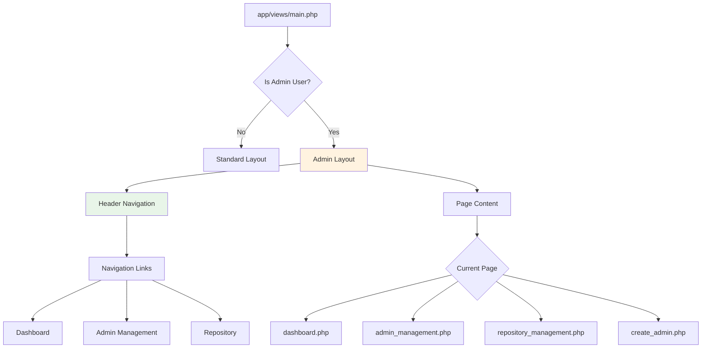
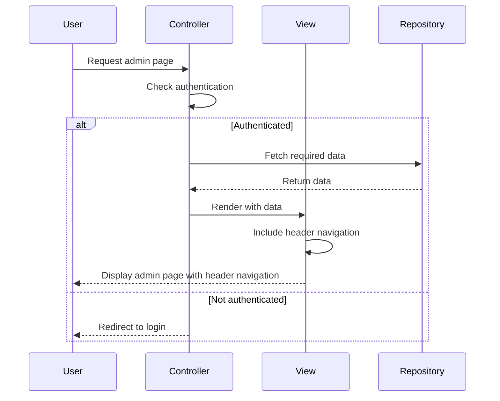

# Admin Dashboard Header Navigation Architecture

## Overview
This diagram shows the architecture and flow of the admin dashboard with the header navigation implementation.

```mermaid
graph TD
    A[User Request] --> B{Is Admin Page?}
    B -->|No| C[Regular Layout]
    B -->|Yes| D[Admin Layout]
    
    C --> E[main.php without admin nav]
    D --> F[main.php with header nav]
    
    F --> G[Header Navigation]
    G --> H[Dashboard Link]
    G --> I[Admin Management Link]
    G --> J[Repository Link]
    
    F --> K[Page Content]
    K --> L{Requested Page}
    L --> M[Dashboard]
    L --> N[Admin Management]
    L --> O[Repository Management]
    
    H --> M
    I --> N
    J --> O
    
    M --> P[AdminController::dashboard()]
    N --> Q[AdminController::adminManagement()]
    O --> R[AdminController::repositoryManagement()]
    
    P --> S[dashboard.php view]
    Q --> T[admin_management.php view]
    R --> U[repository_management.php view]
    
    style G fill:#e1f5fe
    style F fill:#f3e5f5
    style D fill:#fff3e0
```

## Component Structure



## Data Flow



## File Structure

```
app/
├── Controllers/
│   └── AdminController.php (existing - no changes needed)
├── Repositories/
│   └── AdminRepository.php (existing - no changes needed)
├── views/
│   ├── main.php (modified - moved admin navigation to header)
│   ├── dashboard.php (modified - adjust layout)
│   ├── admin_management.php (existing)
│   └── repository_management.php (modified - adjust layout)
public/
└── css/
    └── style.css (existing - no major changes needed)
```

## CSS Class Structure

```mermaid
graph TD
    A[.admin-layout] --> B[.header-navigation]
    A --> C[.main-content]
    
    B --> D[.nav-links]
    D --> E[a.active]
    D --> F[a]
    
    C --> G[.container]
    
    style A fill:#e3f2fd
    style B fill:#f3e5f5
    style C fill:#e8f5e8