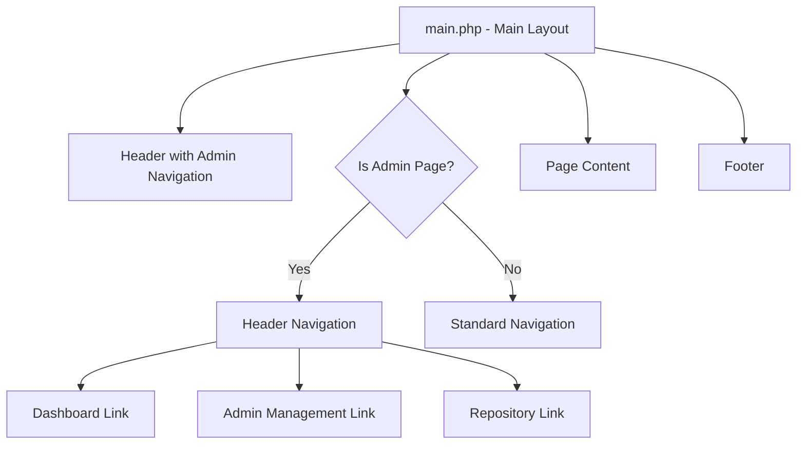

# Admin Dashboard Header Navigation Implementation Plan

## Overview
This plan outlines the implementation of a header navigation menu for the admin dashboard with the following menu items:
1. Admin Dashboard
2. Admin Management
3. Repository

## Current Structure Analysis
- The application uses a template system with `main.php` as the main layout
- Individual pages like `dashboard.php` are rendered within this layout
- Navigation is now handled through header links
- Admin functions are implemented in `AdminController.php`

## Proposed Structure



## Implementation Steps

### 1. Modify Main Layout
- Update `main.php` to include the admin navigation in the header for admin pages
- Add logic to determine when to show the admin navigation
- Adjust the main content area to work without the sidebar

### 2. Update Admin Pages
- Modify existing admin pages to work with the new layout
- Ensure proper spacing and responsiveness

### 3. Add Styling
- Ensure consistent styling with the existing design
- Make it responsive for mobile devices

## File Structure Changes
```
app/views/
├── main.php              (Modified - moved admin navigation to header)
├── dashboard.php         (Modified - adjusted for new layout)
├── repository_management.php (Modified - adjusted for new layout)
└── admin_management.php  (Existing)
```

## AdminController.php Updates
- No changes needed to the controller as navigation is handled in the view

## CSS Updates
- No major CSS changes needed as we're using existing header styling